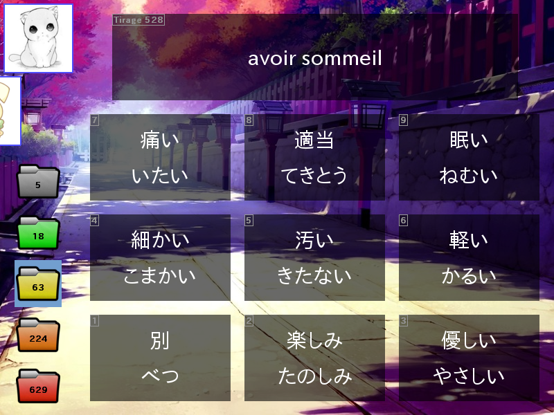

# pyHonGo

pyHonGo is a [pygame](https://www.pygame.org)-based french-japanese vocabulary quizz. It features :

* Efficient learning with the [flashcard](https://en.wikipedia.org/wiki/Flashcard) method,
* Merging of the quizz choices by identical [word class](https://en.wikipedia.org/wiki/Part-of-speech),
* Three independant saving profiles,
* Possibility to use the TV remote control over HDMI with the [CEC](https://en.wikipedia.org/wiki/Consumer_Electronics_Control) protocol.

Table of contents
=================

1. [Installation](#installation)
2. [Usage](#usage)
  * [Launching the game](#launching-the-game)
  * [Game manual](#game-manual)
  * [Changing the default settings](#changing-the-default-settings)
  * [Using the TV remote control](#using-the-tv-remote-control)
3. [Remarks](#remarks)
  * [JLPT level](#jlpt-level)
  * [Identical word class](#identical-word-class)
  * [Enjoy](#enjoy)
4. [Credits](#credits)
5. [License](#license)

Installation
============

Simply copy all the contents to an individual folder, then to start the game simply run `pyHonGo.py` with a Python 2 interpreter:
```
python2 ./pyHonGo.py
```
The dependency **pygame** should be installed on the system. You can get some informations on the [installation details](https://www.pygame.org/wiki/GettingStarted#Pygame%20Installation) on the official pygame website, or if you are running under a debian-based distribution (e.g. Ubuntu) you can simply type:
```
sudo apt-get install python-pygame
```
To use the HDMI CEC protocol to control the game with a TV remote control, the command-line tool **cec-client** should be installed. On Ubuntu you can type:
```
sudo apt-get install cec-utils
```
Note however that TV remote control is not mandatory and is deactivated by default.

Usage
=====

#### Launching the game

To launch the game, go the folder where you installed the files and run:
```
python2 ./pyHonGo.py
```

#### Game manual

In **pyHonGo**, you are asked to translate a french or japanese word into the other language. Each word of vocabulary is designed as a **card** and is stored along **boxes**. The five **boxes** are:

Box 1 | Box 2 | Box 3 | Box 4 | Box 5
----- | ----- | ----- | ----- | -----
 |  |  |  | 

A **card** is picked from one of the **box** and asked to the player. If the answer is true, the **card** goes to the higher-level **box**, otherwise it goes to the lowel-level **box**.

The **box** where the **card** is taken from is the **red box** 3 times out of 4. When it is not chosen, it is the **orange box** 3 times out of 4. Again when it is not chosen, it is the **yellow box** 3 times out of 4, and so on. This is the principle of the flashcard method and implies that the least known **cards** are picked more often.

Initially, only the **red box** is unlocked, and the other ones are locked.

| Locked
| ---
| 

If the **box** is locked, it cannot be picked and the lower-level **box** is chosen. The **box** is permanently unlocked when it contains 10 **cards**.

There are three **profiles** available:

Cat | Bunny | Together
--- | --- | ---
 |  |  

This allows you to be two players, who can play at the same time when you choose the **together profile**.

The game screen is the following :



The bottom-left zone of the screen represents the **boxes**, with the number indicating the current number of **cards** contained inside. The current **box** is highlighted. The top-left zone shows the current **profile**, and the right zone is the current question. You have to guess the right translation among 9 possibilities.

The controls are:

Input | Result
--- | ---
1-9 | Guess translation for current **card**
Arrows | Select one of the proposed translation
Enter | Choose the selected translation
P | Switch **profile**
Q | Exit the game

The game is automatically saved after each answer.

#### Changing the default settings

There is no interface for changing the default settings. The only way to do it is to change the values of the constants in the first lines of the `pyHonGo.py` file :
```
REVERSE_NUMPAD        = False
WITH_REMOTE           = False
FORCE_RESOLUTION      = True
FORCE_RESOLUTION_SIZE = (800,600)
DEBUG                 = False
MAX_JLPT_FOR_DATABASE = 4
```

The meaning of these constants are:

Constant | Meaning
--- | ---
REVERSE_NUMPAD | Changes ordering of the answer. If `False`, "1" is the bottom-left answer (more convenient if the numeric keypad is used), while if set to `True` it is the top-left answer (more convenient if the TV remote control is used)
WITH_REMOTE | `True` or `False`. Enable or disable TV remote control
FORCE_RESOLUTION | If `False`, the game is fullscreen (more convenient on TV) otherwise (if `True`) the resolution is set to `FORCE_RESOLUTION_SIZE`
FORCE_RESOLUTION_SIZE | Set the game resolution to `(size_x, size_y)` if `FORCE_RESOLUTION` is set to `True`
DEBUG | Print information on the screen if set to `True`
MAX_JLPT_FOR_DATABASE | Maximum JLPT level (`5` or `4`), see below for details

#### Using the TV remote control

:warning: **cec-client** needs to be installed, the game must be run on a computer connected in HDMI to a TV screen, and the value of the `WITH_REMOTE` constant must be set to `True` (see above).

The controls of the TV remove are:

Input | Result
--- | ---
1-9 | Guess translation for current **card**
Arrows | Select one of the proposed translation
OK | Choose the selected translation
Blue | Switch **profile**
Exit | Exit the game

As this has only been tested on my personal TV remote control, the key bindings are likely to differ on other TVs / TV remotes. A possible workaround is to manually identify the value of your TV remote and update them in the source file. To identify the values, run:

```
python2 ./remotecontrol.py
```

Then press on the buttons of you TV remote control. The corresponding key values should appear on the screen. Then write the corresponding values to the constants defined at the beginning of the `remotecontrol.py` file. It may be necessary to delete `remotecontrol.pyc`, if it exists, for the changes to be taken into account.

Remarks
=======

#### JLPT level

**JLPT** stands for [Japanese Language Proficiency Test](https://en.wikipedia.org/wiki/Japanese-Language_Proficiency_Test). JLPT level 5 is the easiest level while JLPT level 1 is the hardest level. Only JLPT levels 5 and 4 are available in **pyHonGo**.

#### Identical word class

In japanese, it is often possible to tell the word class of a word even when you do not know its meaning:

* Verbs end with a '-u' hiragana (like る, す or ぬ). Examples: 食べる (eat), 泳ぐ (swim) or 行く (go).
* Some adjectives (*i-adjectives*) end with a い. Examples: 赤い (red), 重い (heavy) or 大きい (big)

Thus when you are asked a translation for a word, you can eliminate the possibilities that belong to a different word class, without even understanding the meaning of the words. This is not desirable so only words of the same class of the word to translate are proposed.

#### Enjoy

I hope you will enjoy this game. 日本語を頑張ってね !

Credits
=======

The dictionnary is a personal derivative work of the two following projects:

* [Obenkyo](http://obenkyo.fr/), which is an amazing android application. The author of Obenkyo kindly gives access to his data files ([here](http://obenkyo.fr/?p=448)) released under the Creative Commons license.
* [JMDICT](http://www.edrdg.org/jmdict/edict_doc.html), a japanese/english dictionnary.

The backgound picture can be found at:
https://alpha.wallhaven.cc/wallpaper/1151

The folder images are personal derivative work (realized with gimp) of the original folder image released under CC BY-NC 3.0 license by Jojo Mendoza:
https://www.iconfinder.com/icons/1215227/documents_folder_generic_mac_icon

License
=======

This program is free software: you can redistribute it and/or modify it under the terms of the GNU General Public License as published by the Free Software Foundation, either version 3 of the License, or (at your option) any later version.

This program is distributed in the hope that it will be useful, but WITHOUT ANY WARRANTY; without even the implied warranty of MERCHANTABILITY or FITNESS FOR A PARTICULAR PURPOSE.  See the GNU General Public License for more details.

You should have received a copy of the GNU General Public License along with this program.  If not, see <http://www.gnu.org/licenses/>.

